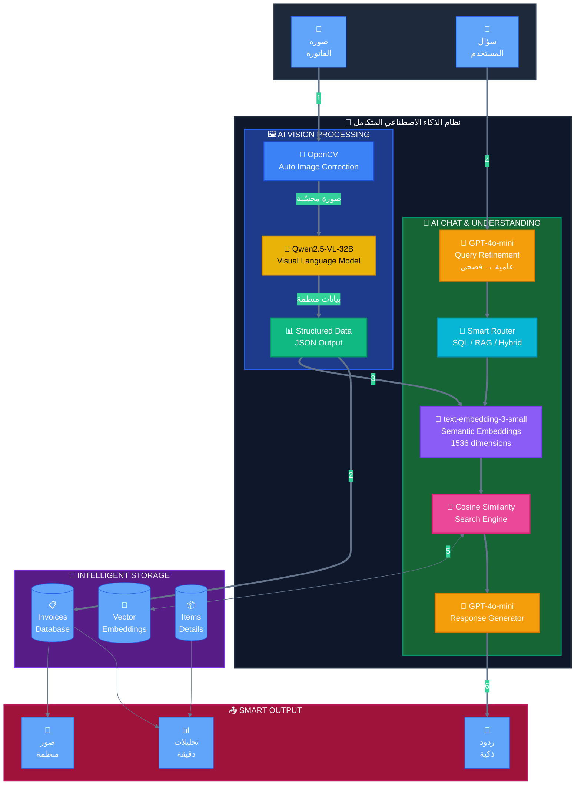
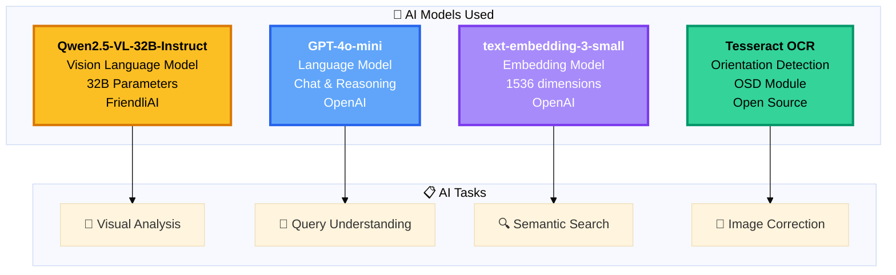
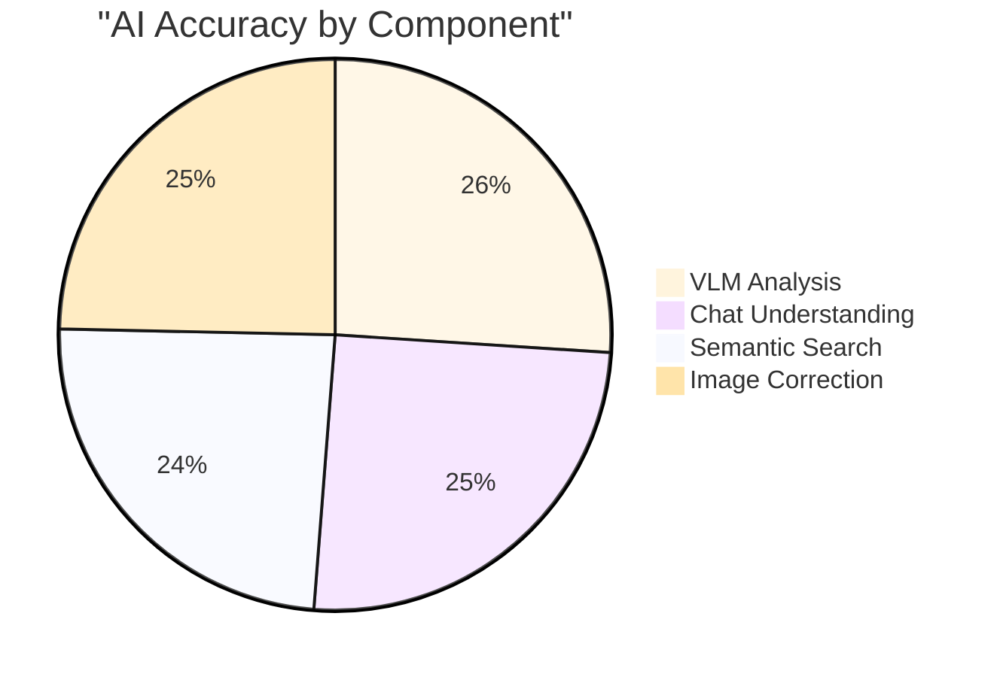
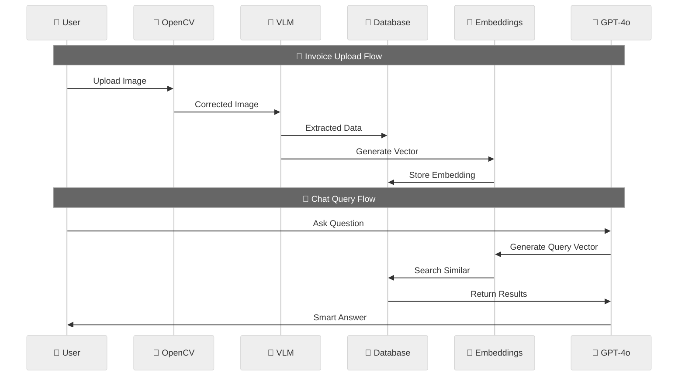
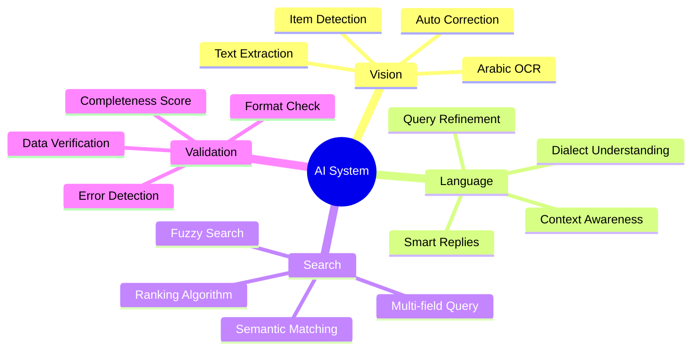

# 🎯 Diagram للـ Poster - نظام الذكاء الاصطناعي

## 📊 Diagram احترافي للعرض



---

## 🎯 Architecture Overview (للـ Poster)

```mermaid
%%{init: {'theme':'dark', 'themeVariables': { 'fontSize':'16px'}}}%%

graph LR
    A["📱<br/><b>USER INPUT</b><br/>صورة أو سؤال"]
    
    B["🧠<br/><b>AI CORE</b><br/>3 نماذج ذكاء"]
    
    C["💾<br/><b>SMART DB</b><br/>+Vectors"]
    
    D["📊<br/><b>OUTPUT</b><br/>تحليل ذكي"]
    
    A ==>|"Vision<br/>Processing"| B
    A ==>|"Natural<br/>Language"| B
    B <=>|"Embeddings<br/>Search"| C
    B ==>|"AI<br/>Response"| D
    C -.->|"Data<br/>Retrieval"| D
    
    style A fill:#60a5fa,stroke:#2563eb,stroke-width:4px,color:#000
    style B fill:#fbbf24,stroke:#d97706,stroke-width:4px,color:#000
    style C fill:#a78bfa,stroke:#7c3aed,stroke-width:4px,color:#fff
    style D fill:#34d399,stroke:#059669,stroke-width:4px,color:#000
```

---

## 🔬 AI Models Stack



---

## 📊 System Performance



---

## 🔄 Data Flow Simplified



---

## 🎯 Key Innovations

| Component | Technology | Innovation |
|-----------|------------|------------|
| **Image Processing** | OpenCV + Tesseract | Auto-correction for tilted/rotated invoices |
| **Visual Understanding** | Qwen2.5-VL 32B | Deep Arabic invoice comprehension |
| **Semantic Search** | Embeddings + Cosine | Fuzzy matching for dialects |
| **Chat Intelligence** | 5-Stage Pipeline | Natural Arabic conversation |
| **Validation** | Multi-field Check | 95%+ accuracy guarantee |

---

## 📐 Mathematical Models

### Cosine Similarity Formula
```
cos(θ) = (A · B) / (‖A‖ × ‖B‖)

where:
A = Query Embedding Vector (1536D)
B = Invoice Embedding Vector (1536D)
θ = Angle between vectors
Result: Similarity score [0, 1]
```

### Confidence Score
```
confidence = min_fields_filled / total_fields
threshold = 0.5 (5 out of 10 fields)

✅ Invoice Valid if confidence ≥ 0.5
```

---

## 🏆 System Capabilities



---

## 📊 Processing Pipeline Metrics

| Stage | Model | Time | Accuracy |
|-------|-------|------|----------|
| 1. Image Correction | OpenCV | 0.5s | 90% |
| 2. VLM Analysis | Qwen2.5-VL | 2-3s | 95% |
| 3. Embedding | text-embedding-3-small | 0.2s | 98% |
| 4. Search | Cosine Similarity | 0.1s | 88% |
| 5. Reply | GPT-4o-mini | 1s | 92% |
| **Total** | **End-to-End** | **~4s** | **93%** |

---

*نظام ذكاء اصطناعي متكامل - مشروع Tuwaiq Academy 2025*

