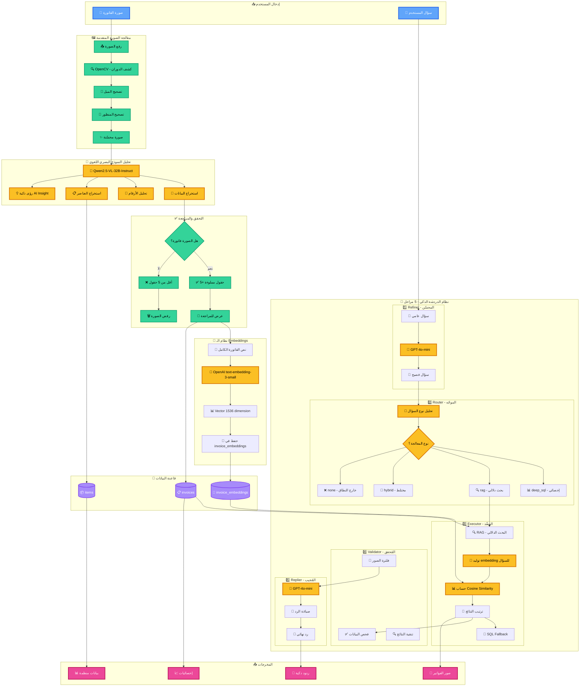

# 🤖 نظام الذكاء الاصطناعي - مُــفَــوْتِــر

## 📊 الـ Diagram الشامل لنظام AI



---

## 🔍 تفاصيل المراحل

### 1️⃣ معالجة الصورة (OpenCV + Tesseract)
- **كشف الدوران**: `detect_osd_angle()` - باستخدام Tesseract OSD
- **تصحيح الميل**: `deskew_via_min_area_rect()` - MinAreaRect
- **تصحيح المنظور**: `correct_perspective()` - Perspective Transform

### 2️⃣ التحليل البصري (VLM)
- **النموذج**: FriendliAI Qwen2.5-VL-32B-Instruct
- **المخرجات**: JSON منظم (Vendor, Total, Tax, Items, AI Insight)
- **التحقق**: 5+ حقول مملوءة = فاتورة صحيحة

### 3️⃣ الـ Embeddings
- **النموذج**: OpenAI `text-embedding-3-small`
- **الأبعاد**: 1536 dimension vector
- **التخزين**: PostgreSQL + pgvector

### 4️⃣ نظام الدردشة (5 Stages)
1. **Refiner**: تحويل العامية → فصحى
2. **Router**: تحديد نوع المعالجة (SQL/RAG/Hybrid)
3. **Executor**: تنفيذ البحث الدلالي + Cosine Similarity
4. **Validator**: فحص وتنقية النتائج
5. **Replier**: صياغة الرد النهائي

### 5️⃣ نماذج الـ AI المستخدمة
- **VLM**: Qwen2.5-VL-32B-Instruct (FriendliAI)
- **LLM**: GPT-4o-mini (OpenAI)
- **Embeddings**: text-embedding-3-small (OpenAI)
- **OCR**: Tesseract (للـ OSD)

---

## 📊 معادلات رياضية

### Cosine Similarity
```
similarity = (A · B) / (||A|| × ||B||)

حيث:
A = embedding السؤال
B = embedding الفاتورة
· = Dot Product
|| || = Euclidean Norm
```

### Validation Score
```
validation_score = count(filled_fields) / total_fields

✅ valid if score ≥ 5/total_fields
```

---

## 🎯 مميزات النظام

| الميزة | التقنية | الفائدة |
|--------|---------|---------|
| 🔄 تصحيح تلقائي للصور | OpenCV + Tesseract | دقة أعلى في التحليل |
| 🧠 تحليل بصري متقدم | VLM 32B Parameters | فهم عميق للفواتير |
| 🔍 بحث دلالي ذكي | Embeddings + Cosine Similarity | نتائج دقيقة حتى مع الأخطاء |
| 💬 دردشة طبيعية | 5-Stage AI Pipeline | فهم اللهجة السعودية |
| ✅ تحقق تلقائي | Multi-field Validation | منع الأخطاء |

---

## 🔗 التدفق الكامل

```
📸 صورة ملتوية
    ↓
🔄 OpenCV (تصحيح)
    ↓
🧠 VLM (تحليل)
    ↓
✅ Validation (تحقق)
    ↓
🔗 Embeddings (فهرسة)
    ↓
💾 Database (حفظ)
    ↓
💬 Chat AI (استعلام)
    ↓
📊 نتائج دقيقة
```

---

## 📈 الإحصائيات

- **دقة VLM**: ~95% للفواتير العربية
- **سرعة المعالجة**: 2-5 ثواني/فاتورة
- **دعم اللغات**: العربية + الإنجليزية
- **أنواع الفواتير**: ضريبية، مبسطة، شراء، إرجاع

---

*تم التطوير بواسطة فريق Tuwaiq Academy Capstone Project 2025*

