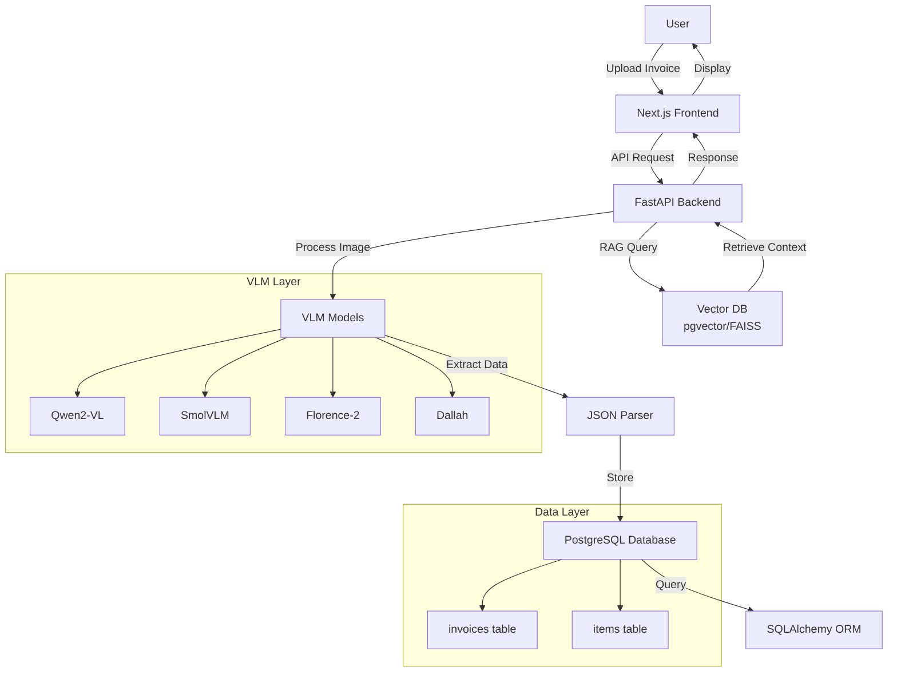

# Invoice Management & Analysis

[](https://fastapi.tiangolo.com/)
[](https://www.postgresql.org/)
[](https://nextjs.org/)
[](https://www.docker.com/)

A modern web-based invoice management system that leverages Vision-Language Models (VLMs) to extract, analyze, and query invoice data in both Arabic and English. Built with FastAPI, PostgreSQL, and Next.js for efficient document processing and intelligent data retrieval.

## Overview

This system automates invoice data extraction using state-of-the-art VLMs with OCR capabilities. Users can upload invoices in various formats, and the system automatically extracts structured metadata and line items, stores them in a PostgreSQL database, and enables natural language querying through Retrieval-Augmented Generation (RAG).

### Key Capabilities

- **Multi-language Support**: Process invoices in Arabic and English seamlessly
- **Intelligent Extraction**: Leverage VLMs (Qwen, Florence, SmolVLM, Dallah) for accurate OCR
- **Structured Storage**: Automatically parse and store invoice data in PostgreSQL
- **Natural Language Queries**: Ask questions about your invoices using RAG
- **RESTful API**: Easy integration with existing systems
- **Modern UI**: Clean, responsive frontend for visualization

## Features

- ✅ **Invoice Upload**: Support for PNG, JPEG, and PDF formats
- ✅ **OCR Extraction**: Powered by multiple VLM models for high accuracy
  - Qwen/Qwen2-VL for general-purpose extraction
  - SmolVLM for efficient processing
  - Florence-2-base for document understanding
  - Dallah for Arabic-optimized OCR
- ✅ **Structured Data Output**: JSON format with complete invoice details
  - Invoice metadata (ID, date, subtotal, credit, tax, balance due)
  - Line items (quantity, description, unit price, amount)
- ✅ **Database Persistence**: PostgreSQL with SQLAlchemy ORM
- ✅ **Intelligent Search**: RAG-powered invoice querying and comparison
- ✅ **RESTful API**: Comprehensive endpoints for all operations
- ✅ **Demo Frontend**: Next.js application with TailwindCSS
- ✅ **Containerized Deployment**: Docker and Docker Compose support

## Architecture



## Tech Stack

### Backend
- **Framework**: FastAPI
- **Database**: PostgreSQL 15+
- **ORM**: SQLAlchemy
- **Vector Search**: pgvector / FAISS (optional)

### AI/ML
- **VLM Models**:
  - Qwen/Qwen2-VL
  - SmolVLM
  - Florence-2-base
  - Dallah (Arabic optimization)
- **RAG**: Retrieval-Augmented Generation for intelligent queries

### Frontend
- **Framework**: Next.js 14+
- **Styling**: TailwindCSS
- **UI Components**: Modern, responsive design

### DevOps
- **Containerization**: Docker
- **Orchestration**: Docker Compose
- **API Documentation**: Auto-generated with FastAPI (Swagger/OpenAPI)

## Database Schema

### `invoices` Table

| Column       | Type         | Description                    |
|--------------|--------------|--------------------------------|
| id           | SERIAL       | Primary key                    |
| invoice_id   | VARCHAR(100) | Unique invoice identifier      |
| date         | DATE         | Invoice date                   |
| subtotal     | DECIMAL(10,2)| Subtotal amount                |
| credit       | DECIMAL(10,2)| Credit amount                  |
| tax          | DECIMAL(10,2)| Tax amount                     |
| balance_due  | DECIMAL(10,2)| Balance due                    |
| created_at   | TIMESTAMP    | Record creation timestamp      |
| updated_at   | TIMESTAMP    | Record update timestamp        |

### `items` Table

| Column       | Type         | Description                    |
|--------------|--------------|--------------------------------|
| id           | SERIAL       | Primary key                    |
| invoice_id   | INTEGER      | Foreign key to invoices.id     |
| quantity     | INTEGER      | Item quantity                  |
| description  | TEXT         | Item description               |
| unit_price   | DECIMAL(10,2)| Price per unit                 |
| amount       | DECIMAL(10,2)| Total line item amount         |

### Relationships
- One invoice has many items (one-to-many relationship)
- Foreign key constraint: `items.invoice_id` → `invoices.id`

## Installation & Setup

### Prerequisites
- Docker and Docker Compose installed
- Python 3.10+ (for local development)
- Node.js 18+ (for frontend development)
- PostgreSQL 15+ (if running without Docker)

### Quick Start with Docker

1. **Clone the repository**
   ```bash
   git clone https://github.com/yourusername/invoice-management.git
   cd invoice-management
   ```

2. **Set up environment variables**
   ```bash
   cp .env.example .env
   ```
   
   Edit `.env` with your configuration:
   ```env
   # Database
   POSTGRES_USER=invoiceuser
   POSTGRES_PASSWORD=securepassword
   POSTGRES_DB=invoicedb
   DATABASE_URL=postgresql://invoiceuser:securepassword@db:5432/invoicedb
   
   # API
   API_HOST=0.0.0.0
   API_PORT=8000
   
   # VLM Models (adjust based on your setup)
   VLM_MODEL=qwen2-vl
   MODEL_CACHE_DIR=./models
   
   # Vector DB (optional)
   USE_VECTOR_DB=true
   VECTOR_DB_TYPE=pgvector
   ```

3. **Launch with Docker Compose**
   ```bash
   docker-compose up -d
   ```

4. **Access the application**
   - Frontend: http://localhost:3000
   - Backend API: http://localhost:8000
   - API Documentation: http://localhost:8000/docs

### Manual Setup (Development)

#### Backend Setup

1. **Create virtual environment**
   ```bash
   cd backend
   python -m venv venv
   source venv/bin/activate  # On Windows: venv\Scripts\activate
   ```

2. **Install dependencies**
   ```bash
   pip install -r requirements.txt
   ```

3. **Initialize database**
   ```bash
   # Make sure PostgreSQL is running
   alembic upgrade head
   ```

4. **Run the backend**
   ```bash
   uvicorn app.main:app --reload --host 0.0.0.0 --port 8000
   ```

#### Frontend Setup

1. **Install dependencies**
   ```bash
   cd frontend
   npm install
   ```

2. **Run development server**
   ```bash
   npm run dev
   ```

### Database Migrations

To create new migrations after schema changes:
```bash
alembic revision --autogenerate -m "Description of changes"
alembic upgrade head
```

## Example Workflow

### 1. Upload Invoice

**Request:**
```bash
curl -X POST "http://localhost:8000/api/v1/invoices/upload" \
  -H "Content-Type: multipart/form-data" \
  -F "file=@invoice.png"
```

### 2. VLM Extraction Output

**Response JSON:**
```json
{
  "invoice_id": "INV-2025-001",
  "date": "2025-09-15",
  "subtotal": 1250.00,
  "credit": 0.00,
  "tax": 187.50,
  "balance_due": 1437.50,
  "items": [
    {
      "quantity": 5,
      "description": "Premium Office Chairs",
      "unit_price": 150.00,
      "amount": 750.00
    },
    {
      "quantity": 2,
      "description": "Standing Desks",
      "unit_price": 250.00,
      "amount": 500.00
    }
  ],
  "status": "success",
  "processing_time": 2.34
}
```

### 3. Query Invoices (RAG)

**Example Queries:**
```bash
# Query invoices by date range
curl -X POST "http://localhost:8000/api/v1/invoices/query" \
  -H "Content-Type: application/json" \
  -d '{"query": "Show me all invoices from September 2025"}'

# Compare vendors
curl -X POST "http://localhost:8000/api/v1/invoices/query" \
  -H "Content-Type: application/json" \
  -d '{"query": "Compare totals between Vendor A and Vendor B"}'

# Analytics query
curl -X POST "http://localhost:8000/api/v1/invoices/query" \
  -H "Content-Type: application/json" \
  -d '{"query": "What is the average invoice amount this quarter?"}'
```

### 4. Retrieve Invoice Details

**Request:**
```bash
curl -X GET "http://localhost:8000/api/v1/invoices/INV-2025-001"
```

**Response:**
```json
{
  "id": 1,
  "invoice_id": "INV-2025-001",
  "date": "2025-09-15",
  "subtotal": 1250.00,
  "credit": 0.00,
  "tax": 187.50,
  "balance_due": 1437.50,
  "items": [
    {
      "id": 1,
      "quantity": 5,
      "description": "Premium Office Chairs",
      "unit_price": 150.00,
      "amount": 750.00
    },
    {
      "id": 2,
      "quantity": 2,
      "description": "Standing Desks",
      "unit_price": 250.00,
      "amount": 500.00
    }
  ],
  "created_at": "2025-09-15T10:30:00Z"
}
```

## API Endpoints

### Invoice Operations
- `POST /api/v1/invoices/upload` - Upload and process invoice
- `GET /api/v1/invoices/{invoice_id}` - Get invoice details
- `GET /api/v1/invoices` - List all invoices (with pagination)
- `DELETE /api/v1/invoices/{invoice_id}` - Delete invoice

### Query & Analysis
- `POST /api/v1/invoices/query` - Natural language query (RAG)
- `POST /api/v1/invoices/compare` - Compare multiple invoices
- `GET /api/v1/invoices/analytics` - Get analytics dashboard data

### Health & Status
- `GET /health` - System health check
- `GET /api/v1/models` - List available VLM models

## Future Enhancements

### Short-term Roadmap
- [ ] Multi-user authentication and role-based access control (RBAC)
- [ ] Enhanced PDF support for scanned documents
- [ ] Batch invoice processing
- [ ] Export functionality (CSV, Excel, PDF)
- [ ] Email notification system

### Medium-term Goals
- [ ] Advanced analytics dashboard with interactive charts
- [ ] Invoice approval workflow
- [ ] Custom field extraction rules
- [ ] Fine-tuned OCR models for Arabic invoices
- [ ] Mobile application (iOS/Android)

### Long-term Vision
- [ ] Cloud deployment templates (AWS, GCP, Azure)
- [ ] Multi-language support expansion (French, Spanish, etc.)
- [ ] Integration with accounting software (QuickBooks, Xero)
- [ ] Automated vendor matching and duplicate detection
- [ ] Machine learning-based anomaly detection
- [ ] Blockchain-based invoice verification

## Contributing

Contributions are welcome! Please follow these steps:

1. Fork the repository
2. Create a feature branch (`git checkout -b feature/amazing-feature`)
3. Commit your changes (`git commit -m 'Add amazing feature'`)
4. Push to the branch (`git push origin feature/amazing-feature`)
5. Open a Pull Request

Please ensure your code follows the project's coding standards and includes appropriate tests.

## License

This project is licensed under the MIT License - see the [LICENSE](LICENSE) file for details.

---

## Acknowledgments

- VLM models: Qwen, Florence, SmolVLM, and Dallah teams
- FastAPI and SQLAlchemy communities
- Next.js and TailwindCSS projects


