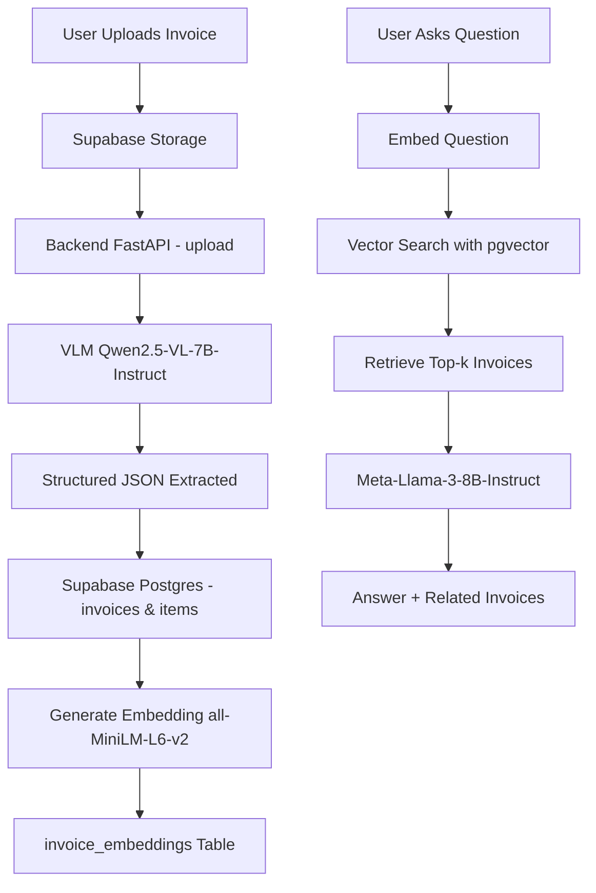

# 📑 invoice mangement system

  
  
  
  


---

## 🚀 Project Overview

The **Smart Invoice Analyzer** is a capstone project that combines **FastAPI**, **Streamlit**, **Supabase**, and **state-of-the-art AI models** to analyze invoices automatically.

### Key Capabilities:
- Automatic extraction of structured invoice data from images
- Secure storage of invoices in Supabase (database + bucket)
- **Semantic search (RAG)** for invoices using embeddings
- A conversational **Chat** interface to ask questions about invoices

---

## ⚙️ Features

- 📤 **Upload** invoice images (JPG/PNG)
- 🧾 **Extract** structured JSON with all key fields (Invoice Number, Date, Vendor, Items, Totals, Discounts, etc)
- 🗄️ **Store** invoice data in **Postgres** and invoice images in **Supabase Storage**
- 🔍 **Generate** embeddings with `all-MiniLM-L6-v2` and store in `pgvector`
- 💬 **Ask** natural language questions about invoices with a **Chat page** powered by RAG
- 🖥️ **Frontend** built with **Streamlit** for easy use

---

## 🧠 Models Used

### ✅ Final Vision-Language Model (VLM)
- **`Qwen/Qwen2.5-VL-7B-Instruct`**  
  Used to analyze invoice images and return structured JSON.

### 🔬 Baseline VLMs Tested
- `Qwen/Qwen2-VL-7B-Instruct`
- `Qwen/Qwen2.5-VL-32B-Instruct`
- `Kosmos-2 (Microsoft)`
- `SmolVLM-2B-Instruct`

### 🗂️ Embedding Model
- **`sentence-transformers/all-MiniLM-L6-v2`** (384 dimensions)  
  Used to generate invoice embeddings for semantic search in `invoice_embeddings`.

### 💬 LLM for Chat
- **`meta-llama/Meta-Llama-3-8B-Instruct:novita`**  
  Used in the **Chat endpoint** to generate natural answers about invoices.

---

## 🔄 Workflow



---

## 📁 Project Structure

```
.
├── backend/
│   ├── main.py                 # FastAPI entrypoint
│   ├── database.py             # DB connection + session
│   ├── utils.py                # Embedding generator
│   ├── routers/                # API endpoints
│   │   ├── upload.py
│   │   ├── vlm.py
│   │   ├── chat.py
│   │   ├── invoices.py
│   │   └── items.py
│   ├── models/                 # SQLAlchemy models
│   │   ├── invoice_model.py
│   │   ├── item_model.py
│   │   └── embedding_model.py
│   └── schemas/                # Pydantic schemas
│       ├── invoice_schema.py
│       └── item_schema.py
├── frontend/
│   ├── app.py                  # Main Streamlit UI
│   └── pages/
│       ├── Chat.py
│       └── Uploaded_Invoices.py
├── models/
│   ├── final_model.py
│   ├── qwen_baseline.ipynb
│   ├── florence_baseline.ipynb
│   ├── kosmos_baseline.ipynb
│   └── smolvlm_baseline.ipynb
├── .env
├── requirements.txt
└── README.md
```

---

## 🛠️ Installation

### Prerequisites
- Python 3.12+
- Supabase account
- API keys for model inference (if applicable)

### Steps

1. **Clone the repository**
   ```bash
   git clone https://github.com/AI-AugToOct/capstone-project-invoice-mangement-system.git
   cd capstone-project-invoice-mangement-system
   ```

2. **Install dependencies**
   ```bash
   pip install -r requirements.txt
   ```

3. **Set up environment variables**
   
   Create a `.env` file in the root directory:
   ```env
   SUPABASE_URL=your_supabase_url
   SUPABASE_KEY=your_supabase_key
   DATABASE_URL=your_postgres_connection_string
   # Add any model API keys here
   ```

4. **Start the backend**
   ```bash
   cd backend
   python -m uvicorn backend.main:app --reload --port 8000
   ```

5. **Start the frontend** (in a new terminal)
   ```bash
   cd frontend
   python -m streamlit run frontend/app.py
   ```

---

## 🎯 Usage

1. **Upload Invoice**: Navigate to the main page and upload an invoice image (JPG/PNG)
2. **View Extraction**: The system automatically extracts structured data from the invoice
3. **Browse Invoices**: Check the "Uploaded Invoices" page to see all stored invoices
4. **Ask Questions**: Use the "Chat" page to ask natural language questions about your invoices

---

## 🔮 Future Enhancements
- Invoice validation  
- Integration with a stronger embedding model  
- Evaluation and selection of a better VLM model  
- Improved UI/UX design  
- Enhanced ability to handle complex invoice cases  


---


---

## 👥 Contributors

- **Maryam**  
- **Lames**  
- **Ruwaa**  
- **Saif**


