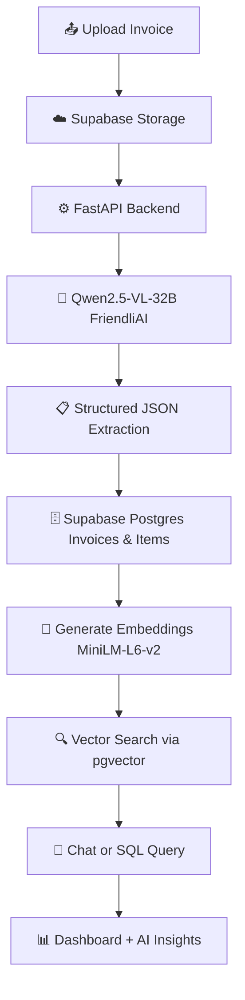

# 📑 Smart Invoice Analyzer — AI-Powered Invoice Management System  


---

## 🚀 Overview
**Smart Invoice Analyzer** is a full-stack AI system that reads invoices (Arabic and English), extracts structured data, classifies the business type, and generates intelligent insights about spending.  
It integrates **FastAPI**, **Streamlit**, **Supabase**, and cutting-edge AI models (**VLM + LLM + Embeddings**).

---

## ⚙️ Key Features
| Feature | Description |
|----------|-------------|
| 🧾 **Invoice Extraction** | Reads Arabic and English invoices and returns structured JSON |
| 🧠 **AI Insights** | Generates multi-sentence insights in English about user spending |
| 🗂️ **Category Detection** | Classifies invoices by business type (Cafe, Restaurant, Pharmacy, etc.) |
| ☁️ **Cloud Storage** | Saves invoice data in Supabase (Postgres + Buckets) |
| 🔍 **Semantic Search (RAG)** | Uses pgvector embeddings for retrieval and similarity |
| 💬 **Chat Interface** | Natural-language Q&A about your invoices using Llama-3 |
| 📊 **Dashboard** | Interactive analytics and visualizations with Plotly |
| 🌐 **Multilingual Support** | Handles invoices written in Arabic, English, or both |

---

## 🧠 AI Models
| Task | Model | Description |
|------|--------|-------------|
| **Vision-Language Extraction** | `Qwen/Qwen2.5-VL-32B-Instruct` (via FriendliAI) | Reads invoice images in Arabic and English |
| **Embeddings** | `sentence-transformers/all-MiniLM-L6-v2` | Generates 384-dimensional embeddings for pgvector |
| **Chat / Reasoning** | `meta-llama/Meta-Llama-3-8B-Instruct:novita` | Answers invoice-related queries |
| **Database / Storage** | Supabase | PostgreSQL + public file storage bucket |

---

## 🔄 System Workflow


---

## 📂 Project Structure
```
.
├── backend/
│   ├── main.py                 # FastAPI entrypoint
│   ├── database.py             # DB connection
│   ├── utils.py                # Embedding generator
│   ├── routers/                # API endpoints
│   │   ├── upload.py
│   │   ├── vlm.py
│   │   ├── chat.py
│   │   ├── dashboard.py
│   │   ├── invoices.py
│   │   └── items.py
│   ├── models/
│   │   ├── invoice_model.py
│   │   ├── item_model.py
│   │   └── embedding_model.py
│   └── schemas/
│       ├── invoice_schema.py
│       └── item_schema.py
├── frontend/
│   ├── app.py                  # Streamlit main UI
│   └── pages/
│       ├── Dashboard.py
│       ├── Chat.py
│       └── Uploaded_Invoices.py
├── .env
├── requirements.txt
└── README.md
```

---

## 🛠️ Installation

### Prerequisites
* Python 3.12+
* Supabase project with database + storage
* FriendliAI and HuggingFace tokens

### Setup Steps

```bash
# 1️⃣ Clone the repository
git clone https://github.com/AI-AugToOct/capstone-project-invoice-mangement-system.git
cd capstone-project-invoice-mangement-system

# 2️⃣ Install dependencies
pip install -r requirements.txt

# 3️⃣ Add environment variables
echo "
SUPABASE_URL=your_supabase_url
SUPABASE_KEY=your_supabase_key
DATABASE_URL=your_postgres_connection
FRIENDLI_TOKEN=your_friendli_token
HF_TOKEN=your_huggingface_token
" > .env

# 4️⃣ Start backend
uvicorn backend.main:app --reload --port 8000

# 5️⃣ Start frontend
streamlit run frontend/app.py
```

---

## 🎯 Usage Flow

1. **Upload Invoice** → image saved to Supabase storage
2. **AI Extraction** → FriendliAI VLM extracts structured JSON
3. **Data Storage** → results stored in Supabase Postgres
4. **Embeddings** → semantic vectors stored in invoice_embeddings
5. **Chat Interface** → ask questions like "What's my total spending at cafes?"
6. **Dashboard** → visualize trends, vendors, and spending categories

---

## 🔮 Future Enhancements

- 🧠 Improve AI precision in extraction  
- 🎨 Enhance UI design for better user experience  
- 💬 Improve query handling and chat   
- 🔧 Explore fine-tuning options for the vision-language model (VLM)


---

## 👥 Team

- **Maryam**
- **Lames**
- **Ruwaa**
- **Saif Alotibie**
