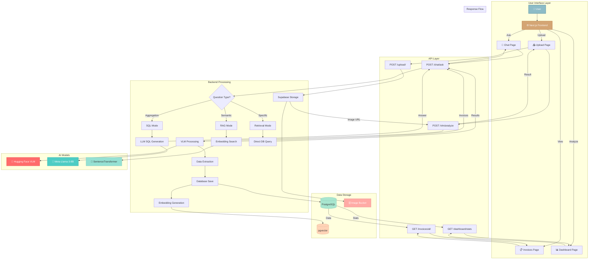
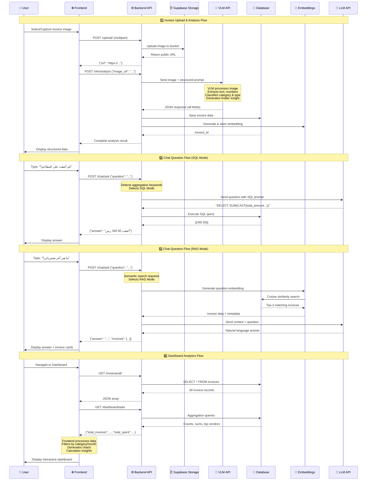
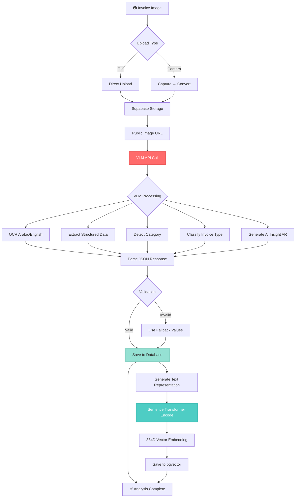
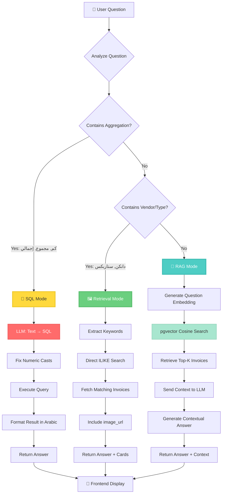
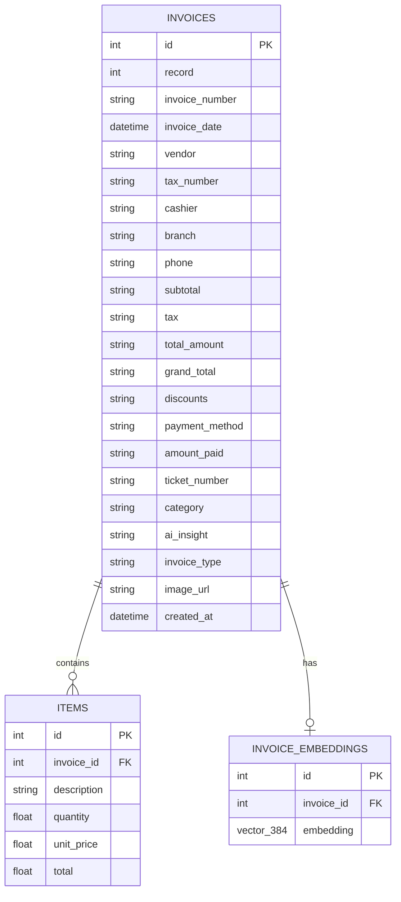
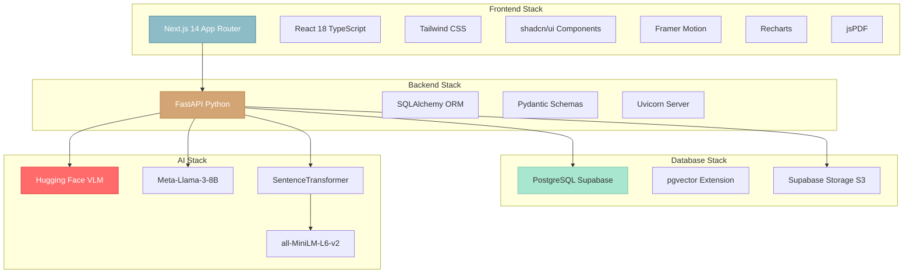
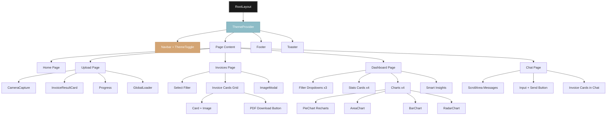
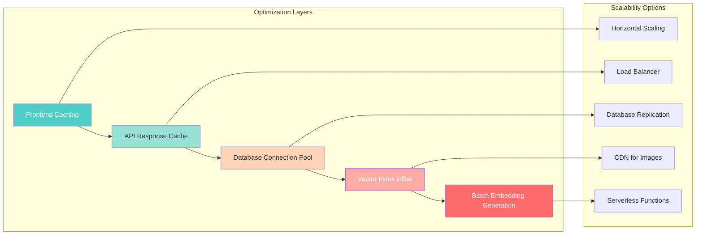
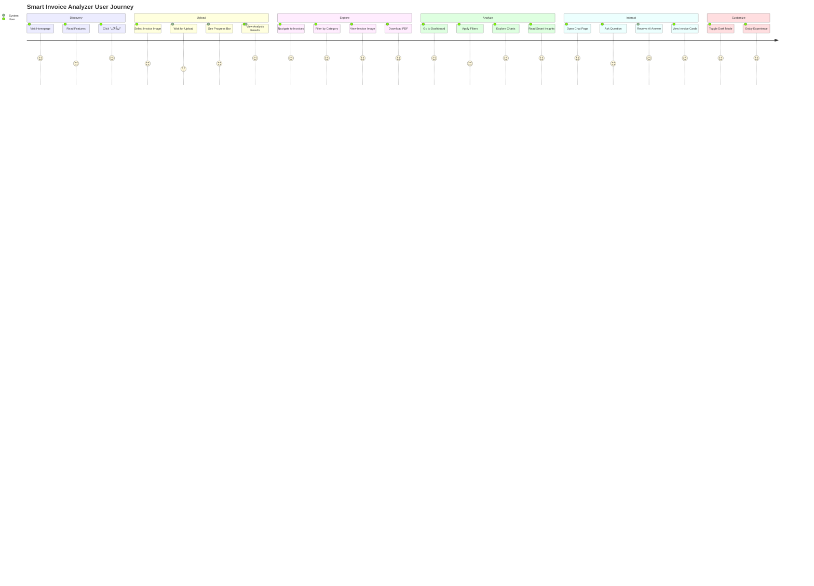

# Smart Invoice Analyzer — End-to-End Workflow

## 🎨 Complete System Architecture



---

## 📊 Detailed Data Flow Diagram



---

## 🔄 Component Interaction Diagram

```mermaid
graph LR
    subgraph "Frontend Components"
        A[Home Page] --> B[Navbar]
        C[Upload Page] --> D[CameraCapture]
        C --> E[InvoiceResultCard]
        F[Invoices Page] --> G[ImageModal]
        H[Dashboard Page] --> I[Charts Recharts]
        J[Chat Page] --> K[ScrollArea]
        J --> L[Invoice Cards]
    end
    
    subgraph "API Calls"
        C --> M[/upload/ + /vlm/analyze]
        F --> N[/invoices/all]
        H --> O[/dashboard/stats + /invoices/all]
        J --> P[/chat/ask]
    end
    
    subgraph "Backend Routes"
        M --> Q[upload.py + vlm.py]
        N --> R[invoices.py]
        O --> S[dashboard.py + invoices.py]
        P --> T[chat.py]
    end
    
    subgraph "Data Layer"
        Q --> U[(invoices table)]
        Q --> V[(invoice_embeddings)]
        R --> U
        S --> U
        T --> U
        T --> V
        T --> W[LLM]
    end
    
    style A fill:#8dbcc7,stroke:#6fa3b0,stroke-width:2px
    style C fill:#d4a574,stroke:#c89563,stroke-width:2px
    style F fill:#a8e6cf,stroke:#98d6bf,stroke-width:2px
    style H fill:#ffd3b6,stroke:#efc3a6,stroke-width:2px
    style J fill:#ffaaa5,stroke:#ef9a95,stroke-width:2px
```

---

## 🧠 AI Processing Pipeline



---

## 💬 Hybrid Chat Intelligence Flow



---

## 📊 Database Schema Relationships



---

## 🚀 Technology Stack Overview



---

## 🎨 UI Component Hierarchy



---

## 📈 Performance & Scalability



---

## 🎯 User Journey Map



---

**This diagram suite provides a comprehensive visual overview of the Smart Invoice Analyzer system, suitable for presentations, documentation, and poster displays.**

**Color Legend:**
- 🔵 **Teal (#8dbcc7)**: Frontend/UI components
- 🟡 **Gold (#d4a574)**: Backend/API layer
- 🟢 **Green (#a8e6cf)**: Database/Storage
- 🔴 **Red (#ff6b6b)**: AI/ML models
- 🟣 **Purple (#95e1d3)**: Processing/Logic

---

**Last Updated**: October 7, 2025  
**Version**: 1.0.0

