# Smart Invoice Analyzer — End-to-End Workflow

## 🎨 Complete System Architecture

```mermaid
graph TB
    subgraph "User Interface Layer"
        A[👤 User] --> B[🌐 Next.js Frontend]
        B --> |Upload| C[📤 Upload Page]
        B --> |View| D[📋 Invoices Page]
        B --> |Analyze| E[📊 Dashboard Page]
        B --> |Ask| F[💬 Chat Page]
    end
    
    subgraph "API Layer"
        C --> G[POST /upload/]
        C --> H[POST /vlm/analyze]
        D --> I[GET /invoices/all]
        E --> J[GET /dashboard/stats]
        F --> K[POST /chat/ask]
    end
    
    subgraph "Backend Processing"
        G --> L[Supabase Storage]
        L --> |Image URL| H
        H --> M[VLM Processing]
        M --> N[Data Extraction]
        N --> O[Database Save]
        O --> P[Embedding Generation]
        
        K --> Q{Question Type?}
        Q --> |Aggregation| R[SQL Mode]
        Q --> |Semantic| S[RAG Mode]
        Q --> |Specific| T[Retrieval Mode]
        
        R --> U[LLM SQL Generation]
        S --> V[Embedding Search]
        T --> W[Direct DB Query]
    end
    
    subgraph "Data Storage"
        O --> X[(PostgreSQL)]
        P --> Y[(pgvector)]
        L --> Z[🗄️ Image Bucket]
    end
    
    subgraph "AI Models"
        M --> AA[🤖 Hugging Face VLM]
        U --> AB[🧠 Meta-Llama-3-8B]
        V --> AC[🔎 SentenceTransformer]
    end
    
    subgraph "Response Flow"
        X --> |Data| I
        X --> |Stats| J
        U --> |Answer| K
        V --> |Invoices| K
        W --> |Results| K
        
        I --> D
        J --> E
        K --> F
        H --> |Result| C
    end
    
    style A fill:#8dbcc7,stroke:#6fa3b0,stroke-width:3px,color:#fff
    style B fill:#d4a574,stroke:#c89563,stroke-width:3px,color:#fff
    style AA fill:#ff6b6b,stroke:#ee5a5a,stroke-width:2px,color:#fff
    style AB fill:#4ecdc4,stroke:#3dbdb4,stroke-width:2px,color:#fff
    style AC fill:#95e1d3,stroke:#85d1c3,stroke-width:2px,color:#333
    style X fill:#a8e6cf,stroke:#98d6bf,stroke-width:2px,color:#333
    style Y fill:#ffd3b6,stroke:#efc3a6,stroke-width:2px,color:#333
    style Z fill:#ffaaa5,stroke:#ef9a95,stroke-width:2px,color:#fff
```



---

## 📊 Detailed Data Flow Diagram

```mermaid
sequenceDiagram
    participant U as 👤 User
    participant F as 🌐 Frontend
    participant B as ⚙️ Backend API
    participant S as 🗄️ Supabase Storage
    participant V as 🤖 VLM API
    participant D as 💾 Database
    participant E as 🔎 Embeddings
    participant L as 🧠 LLM API

    Note over U,L: 1️⃣ Invoice Upload & Analysis Flow
    
    U->>F: Select/Capture Invoice Image
    F->>B: POST /upload/ (multipart)
    B->>S: Upload image to bucket
    S-->>B: Return public URL
    B-->>F: {"url": "https://..."}
    
    F->>B: POST /vlm/analyze {"image_url": "..."}
    B->>V: Send image + structured prompt
    
    Note over V: VLM processes image<br/>Extracts text, numbers<br/>Classifies category & type<br/>Generates Arabic insight
    
    V-->>B: JSON response (all fields)
    B->>D: Save invoice data
    B->>E: Generate & store embedding
    D-->>B: invoice_id
    B-->>F: Complete analysis result
    F->>U: Display structured data

    Note over U,L: 2️⃣ Chat Question Flow (SQL Mode)
    
    U->>F: Type: "كم أنفقت على المطاعم؟"
    F->>B: POST /chat/ask {"question": "..."}
    
    Note over B: Detects aggregation keywords<br/>Selects SQL Mode
    
    B->>L: Send question with SQL prompt
    L-->>B: "SELECT SUM(CAST(total_amount...))"
    B->>D: Execute SQL query
    D-->>B: [(345.50)]
    B-->>F: {"answer": "أنفقت 345.50 ر.س"}
    F->>U: Display answer

    Note over U,L: 3️⃣ Chat Question Flow (RAG Mode)
    
    U->>F: Type: "ما هي آخر مشترياتي؟"
    F->>B: POST /chat/ask {"question": "..."}
    
    Note over B: Semantic search required<br/>Selects RAG Mode
    
    B->>E: Generate question embedding
    E->>D: Cosine similarity search
    D-->>E: Top-3 matching invoices
    E-->>B: Invoice data + metadata
    B->>L: Send context + question
    L-->>B: Natural language answer
    B-->>F: {"answer": "...", "invoices": [...]}
    F->>U: Display answer + invoice cards

    Note over U,L: 4️⃣ Dashboard Analytics Flow
    
    U->>F: Navigate to Dashboard
    F->>B: GET /invoices/all
    B->>D: SELECT * FROM invoices
    D-->>B: All invoice records
    B-->>F: JSON array
    
    F->>B: GET /dashboard/stats
    B->>D: Aggregation queries
    D-->>B: Counts, sums, top vendors
    B-->>F: {"total_invoices": ..., "total_spent": ...}
    
    Note over F: Frontend processes data<br/>Filters by category/month<br/>Generates charts<br/>Calculates insights
    
    F->>U: Display interactive dashboard
```



---

## 🔄 Component Interaction Diagram

```mermaid
graph LR
    subgraph "Frontend Components"
        A[Home Page] --> B[Navbar]
        C[Upload Page] --> D[CameraCapture]
        C --> E[InvoiceResultCard]
        F[Invoices Page] --> G[ImageModal]
        H[Dashboard Page] --> I[Charts Recharts]
        J[Chat Page] --> K[ScrollArea]
        J --> L[Invoice Cards]
    end
    
    subgraph "API Calls"
        C --> M[/upload/ + /vlm/analyze]
        F --> N[/invoices/all]
        H --> O[/dashboard/stats + /invoices/all]
        J --> P[/chat/ask]
    end
    
    subgraph "Backend Routes"
        M --> Q[upload.py + vlm.py]
        N --> R[invoices.py]
        O --> S[dashboard.py + invoices.py]
        P --> T[chat.py]
    end
    
    subgraph "Data Layer"
        Q --> U[(invoices table)]
        Q --> V[(invoice_embeddings)]
        R --> U
        S --> U
        T --> U
        T --> V
        T --> W[LLM]
    end
    
    style A fill:#8dbcc7,stroke:#6fa3b0,stroke-width:2px
    style C fill:#d4a574,stroke:#c89563,stroke-width:2px
    style F fill:#a8e6cf,stroke:#98d6bf,stroke-width:2px
    style H fill:#ffd3b6,stroke:#efc3a6,stroke-width:2px
    style J fill:#ffaaa5,stroke:#ef9a95,stroke-width:2px
```

---

## 🧠 AI Processing Pipeline


---

## 💬 Hybrid Chat Intelligence Flow

```mermaid
graph TB
    A[👤 User Question] --> B{Analyze Question}
    
    B --> C{Contains Aggregation?}
    C -->|Yes: كم, مجموع, إجمالي| D[🧮 SQL Mode]
    C -->|No| E{Contains Vendor/Type?}
    
    E -->|Yes: دانكن, ستاربكس| F[🖼️ Retrieval Mode]
    E -->|No| G[📄 RAG Mode]
    
    D --> H[LLM: Text → SQL]
    H --> I[Fix Numeric Casts]
    I --> J[Execute Query]
    J --> K[Format Result in Arabic]
    K --> L[Return Answer]
    
    F --> M[Extract Keywords]
    M --> N[Direct ILIKE Search]
    N --> O[Fetch Matching Invoices]
    O --> P[Include image_url]
    P --> Q[Return Answer + Cards]
    
    G --> R[Generate Question Embedding]
    R --> S[pgvector Cosine Search]
    S --> T[Retrieve Top-K Invoices]
    T --> U[Send Context to LLM]
    U --> V[Generate Contextual Answer]
    V --> W[Return Answer + Context]
    
    L --> X[📱 Frontend Display]
    Q --> X
    W --> X
    
    style D fill:#ffd93d,stroke:#efc92d,stroke-width:3px,color:#333
    style F fill:#6bcf7f,stroke:#5bbf6f,stroke-width:3px,color:#fff
    style G fill:#4ecdc4,stroke:#3ebdb4,stroke-width:3px,color:#fff
    style H fill:#ff6b6b,stroke:#ef5b5b,stroke-width:2px,color:#fff
    style S fill:#a8e6cf,stroke:#98d6bf,stroke-width:2px,color:#333
```



---

## 📊 Database Schema Relationships


---

## 🚀 Technology Stack Overview


---

## 🎨 UI Component Hierarchy


---

## 📈 Performance & Scalability


---

## 🎯 User Journey Map


---

**This diagram suite provides a comprehensive visual overview of the Smart Invoice Analyzer system, suitable for presentations, documentation, and poster displays.**

**Color Legend:**
- 🔵 **Teal (#8dbcc7)**: Frontend/UI components
- 🟡 **Gold (#d4a574)**: Backend/API layer
- 🟢 **Green (#a8e6cf)**: Database/Storage
- 🔴 **Red (#ff6b6b)**: AI/ML models
- 🟣 **Purple (#95e1d3)**: Processing/Logic

---

**Last Updated**: October 7, 2025  
**Version**: 1.0.0

